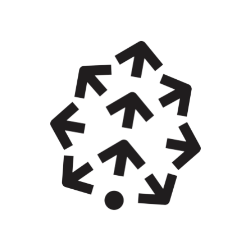

# Hi there! 👋 I'm Raghu Gannaram

🌌 **Full Stack Developer | Cloud Architect | Applied ML/AI Engineer**

I’m passionate about creating **reliable, scalable, and intelligent applications** and exploring the intersection of **web, cloud, and machine learning**. I enjoy experimenting with new technologies and transforming innovative ideas into real-world solutions.

-   👀 I’m interested in ... Web development, Cloud & DevOps, Applied ML/AI and other Cutting-edge Technologies
-   🌱 I’m currently learning ... Deep learning, improving and optimizing ML models, and integrating them into full stack applications
-   💞️ I’m looking to collaborate on ... Buddy projects leveraging full stack development with applied ML/AI solutions
-   🔭 I love Astronomy, Just look at the stars

## 🔧 TechStack

### Programming Languages :

 

---

### Frontend :

 

---

### Backend :

 

---

### Databases :

 

---

### Cloud & DevOps :

 

---

### AI & Machine Learning :

 

<!-- ## 🎓 Certifications

-   🏅 Microsoft Certified Azure Fundamentals (AZ-900)
-   🏅 Microsoft Certified Artificial Intelligence (AI-900)
-   🏅 Microsoft Certified Security, Compliance, and Identity (SC-900)
-   🏅 Microsoft Certified Data Platform (DP-900)
-   🏅 Microsoft Certified Power Platform (PL-900)
-   🏅 Microsoft Certified Azure Administrator (AZ-104)
-   🏅 Qualys Certified Web Application Scanning Specialist
-   🏅 Wix Certified Accessibility Specialist -->

<!-- ## 📫 Let's Connect

 -->
