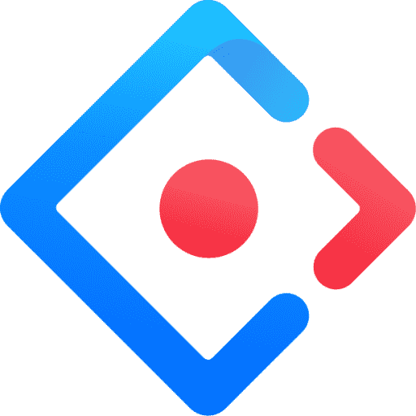
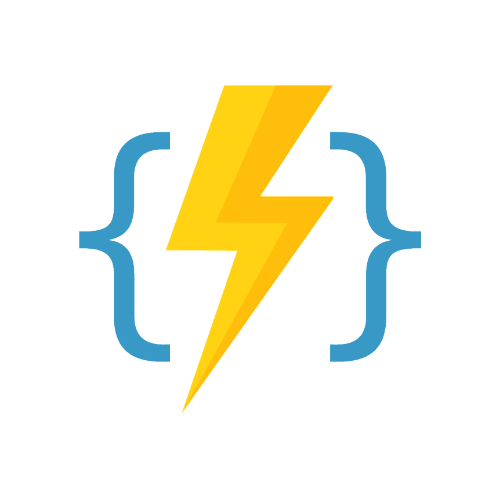

# Hi there! 👋 I'm Raghu Gannaram

-   👀 I’m interested in ... Web Development
-   🌱 I’m currently learning ... Cloud Computing & Web 3.0
-   💞️ I’m looking to collaborate on ... Buddy full stack projects
-   🔭 I love Astronomy, Just look at the stars

## 🔧 TechStack

### Frontend :

 

---

### Backend :

 

---

### Database :

 

---

### Infrastructure :

 

---

<!-- ## 🎓 Certifications

-   🏅 Microsoft Certified Azure Fundamentals (AZ-900)
-   🏅 Microsoft Certified Artificial Intelligence (AI-900)
-   🏅 Microsoft Certified Security, Compliance, and Identity (SC-900)
-   🏅 Microsoft Certified Data Platform (DP-900)
-   🏅 Microsoft Certified Power Platform (PL-900)
-   🏅 Microsoft Certified Azure Administrator (AZ-104)
-   🏅 Qualys Certified Web Application Scanning Specialist
-   🏅 Wix Certified Accessibility Specialist -->

<!-- ## 📫 Let's Connect

 -->
